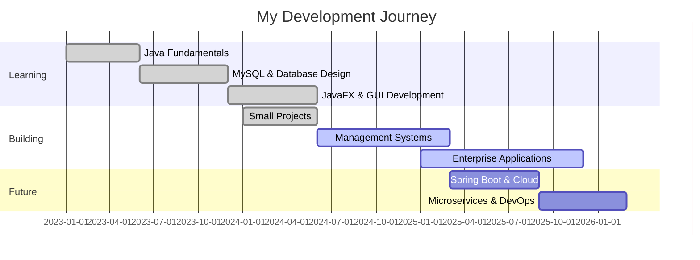

<p align="center">
  
</p>

<p align="center">
  <a href="https://linkedin.com/in/tharushasamarasinha">
    
  </a>
  <a href="https://www.hackerrank.com/tharushasamarasinha">
    
  </a>
  <a href="mailto:tharusha@example.com">
    
  </a>
  
</p>

<h3 align="center">🚀 Future Software Engineer | Java Specialist | Tech Enthusiast</h3>

<p align="center">
  
</p>

<p align="center">
  
</p>

---

### 👨‍💻 About Me

```javascript
const tharusha = {
    location: "Sri Lanka 🇱🇰",
    role: "Student Software Engineer",
    nickname: "TDS",
    currentFocus: ["JavaFX", "Advanced MySQL", "Enterprise Software Design"],
    interests: ["Management Systems", "Automation", "Clean Code"],
    goal: "Building efficient, real-world solutions that simplify lives",
    lifePhilosophy: "Code • Learn • Build • Repeat",
    funFact: "I turn coffee into code ☕ → 💻",
    availability: {
        collaboration: true,
        openSource: true,
        innovation: true
    }
};
```

<details>
<summary>📖 More about me</summary>

- 🔭 I'm currently working on **Enterprise Management Systems**
- 🌱 I'm currently learning **Spring Boot & Microservices Architecture**
- 👯 I'm looking to collaborate on **Java-based Backend Projects**
- 💬 Ask me about **Java, MySQL, JavaFX, System Design**
- 🎯 2025 Goal: **Master Cloud Deployment & Contribute to Open Source**
- ⚡ Fun fact: **My peers call me TDS - The Debug Specialist!**

</details>

---

### 🎯 Current Focus

<table>
<tr>
<td width="50%">

#### 🔴 Working On
```yaml
project: Enterprise ERP System
stack: [Java, MySQL, JavaFX]
status: In Development
progress: 80%
```

</td>
<td width="50%">

#### 📚 Learning
```yaml
technologies:
  - Spring Boot
  - Docker & Kubernetes
  - Microservices Architecture
  - AWS Cloud Services
```

</td>
</tr>
</table>

---

### 🛠️ Tech Stack & Tools

<div align="center">

#### Languages


#### Databases


#### Frameworks & Libraries


#### Tools & DevOps


</div>

<details>
<summary>📊 Detailed Skills Breakdown</summary>

| Category | Skills | Proficiency |
|:---------|:-------|:-----------:|
| **Backend** | Java, Spring Boot, RESTful APIs | ████████░░ 85% |
| **Database** | MySQL, PostgreSQL, Oracle | ████████░░ 80% |
| **Frontend** | JavaFX, HTML/CSS, JavaScript | ███████░░░ 70% |
| **DevOps** | Docker, Linux, Git | ██████░░░░ 60% |
| **Architecture** | OOP, Design Patterns, MVC | ████████░░ 85% |

</details>

---

### 🏆 GitHub Trophies

<p align="center">
  
</p>

---

### 📂 Featured Projects

<table>
<tr>
<td width="50%">

#### 🚤 Boat Reservation System
A comprehensive management system for booking and scheduling boat reservations with real-time availability tracking.

**Tech Stack:** `Java` `MySQL` `JavaFX` `JDBC`

**Features:**
- ✅ Real-time booking management
- ✅ Customer database integration
- ✅ Automated scheduling system
- ✅ Invoice generation

[🔗 View Project](#)

</td>
<td width="50%">

#### 📦 Stock Master Pro
Advanced inventory tracking system with real-time stock updates, low-stock alerts, and comprehensive reporting.

**Tech Stack:** `Java` `File Handling` `JavaFX`

**Features:**
- ✅ Multi-category inventory
- ✅ Low stock notifications
- ✅ Sales analytics dashboard
- ✅ Export to Excel/PDF

[🔗 View Project](#)

</td>
</tr>
<tr>
<td width="50%">

#### 🔐 Secure Auth System
Custom credential management system with advanced encryption and secure authentication protocols.

**Tech Stack:** `Java` `Security` `MySQL`

**Features:**
- ✅ Password encryption (SHA-256)
- ✅ Session management
- ✅ Role-based access control
- ✅ Audit logging

[🔗 View Project](#)

</td>
<td width="50%">

#### 🏥 Hospital Management System
End-to-end hospital management solution for patient records, appointments, and billing.

**Tech Stack:** `Java` `MySQL` `JavaFX`

**Features:**
- ✅ Patient registration
- ✅ Appointment scheduling
- ✅ Medical records management
- ✅ Billing & payments

[🔗 View Project](#)

</td>
</tr>
</table>

<p align="center">
  <a href="https://github.com/Tharushadils?tab=repositories">
    
  </a>
</p>

---

### 📊 GitHub Statistics

<p align="center">
  
  
</p>

<p align="center">
  
  
</p>

---

### 📈 Contribution Graph

<p align="center">
  
</p>

<!--
Uncomment this section after setting up the snake animation action
<p align="center">
  
</p>
-->

---

### 💼 Experience & Timeline



---


### 📚 Latest Blog Posts & Articles

<!-- BLOG-POST-LIST:START -->
- 🚀 Building Scalable Java Applications with Design Patterns
- 💾 Optimizing MySQL Queries: A Practical Guide
- 🎨 Creating Beautiful JavaFX Interfaces
- 🔐 Implementing Secure Authentication in Java
<!-- BLOG-POST-LIST:END -->

<p align="center">
  <a href="https://dev.to/tharushadils">
    
  </a>
</p>

---

### 🎮 When I'm Not Coding

<div align="center">

| 🎯 Hobby | 📝 Description |
|:--------:|:--------------|
| 🎵 Music | Coding with Lo-fi beats |
| 📚 Reading | Tech blogs & System Design |
| 🏋️ Fitness | Keeping body & mind sharp |
| 🎮 Gaming | Strategy & puzzle games |
| ☕ Coffee | Fuel for creativity |

</div>

---

### 🤝 Connect & Collaborate

<p align="center">
  <a href="https://linkedin.com/in/tharushasamarasinha">
    
  </a>
  <a href="https://www.hackerrank.com/tharushasamarasinha">
    
  </a>
  <a href="mailto:tharusha@example.com">
    
  </a>
</p>

---

### 💡 Philosophy & Quote

<p align="center">
  
</p>

<div align="center">

> **"Code • Learn • Build • Repeat"**
>
> *Striving for progress, not just perfection.*
>
> — TDS (That's Me! 😄)

</div>

---

### 📊 Weekly Development Breakdown

<!--START_SECTION:waka-->
<!--END_SECTION:waka-->

<!-- If you want to add WakaTime stats, you'll need to set up the GitHub Action -->

<details>
<summary>⚙️ Development Stats (Click to expand)</summary>

```text
Java         12 hrs 30 mins  ████████████░░░░░░░  60.5%
SQL          3 hrs 45 mins   ████░░░░░░░░░░░░░░░  18.2%
XML          2 hrs 15 mins   ██░░░░░░░░░░░░░░░░░  10.9%
JavaScript   1 hr 30 mins    █░░░░░░░░░░░░░░░░░░   7.3%
Other        38 mins         ░░░░░░░░░░░░░░░░░░░   3.1%
```

</details>

---

### 🎯 2025 Goals

- [x] Master JavaFX for enterprise applications
- [x] Build 5+ production-ready management systems
- [ ] Contribute to 10+ open source projects
- [ ] Learn Spring Boot & Microservices
- [ ] Deploy applications on AWS Cloud
- [ ] Write 20+ technical blog posts
- [ ] Earn professional Java certifications

---

### 🌟 Fun Facts About My Code

<div align="center">

| Metric | Value |
|:------:|:-----:|
| ☕ Cups of Coffee | ∞ |
| 🐛 Bugs Fixed | 1000+ |
| 💻 Lines of Code | 50K+ |
| 🌙 Late Night Coding Sessions | Too Many 😅 |
| 🎯 Problems Solved | 500+ |

</div>

---

### 📈 Contribution Activity

<p align="center">
  
</p>

---

### 🎨 Profile Views Over Time

<p align="center">
  
</p>

---

<p align="center">
  
</p>

<h3 align="center">💻 "The only way to do great work is to love what you do" 💻</h3>

<p align="center">
  
</p>

---

<p align="center">
  <b>⭐️ From <a href="https://github.com/Tharushadils">Tharushadils</a> | Thanks for visiting! Let's build something amazing together! 🚀</b>
</p>
